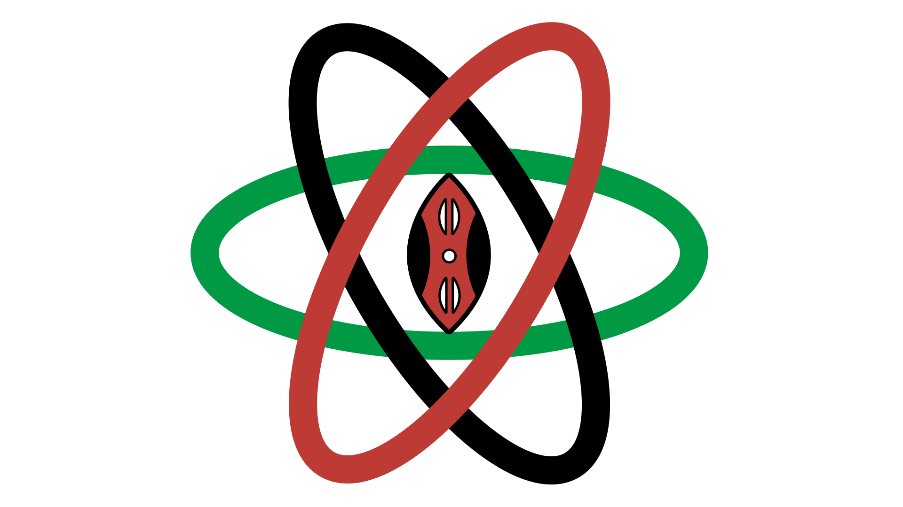

<h1 align="center" style="margin-top: 1em; margin-bottom: 3em;">
  <p><a href="https://reactdevske.netlify.app/"></a></p>
  <p>  Welcome to Reactjs Developer Community Kenya Website!</p>
</h1>

This is the repository for the showcase website of the React Developer Community in Kenya.

Check out the live version [HERE](https://reactdevske.vercel.app/)

---

## Table of Contents

- [Project Overview](#project-overview)
- [Features](#features)
- [Getting Started](#getting-started)
- [Contributing to the Project](#contributing-to-the-project)
- [Technologies Used](#technologies-used)
- [Figma Design File](#figma-design-file)
- [FAQs](#faqs)
- [License](#license)
- [Contact](#contact)

---

## Project Overview

The React Developers Kenya Website is a platform designed to showcase the vibrant React.js developer community in Kenya. It serves as a hub for developers to connect, share knowledge, and collaborate on projects. The website is open-source and welcomes contributions from developers worldwide and across the country.

---

## Features

- Showcase of the React Developer Community in Kenya.
- Open-source and community-driven.
- Responsive design for seamless use across devices.
- Easy-to-navigate structure for contributors and users.
- Integration with GitHub for issue tracking and contributions.

---

## Getting Started

To get a local copy up and running, follow these steps:

### Prerequisites

Ensure you have the following installed:

- [Node.js](https://nodejs.org/)
- [Git](https://git-scm.com/)

### Installation

1. Clone the repository:

```bash
   git clone https://github.com/reactdeveloperske/reactdevske-website.git
```

2. Navigate to the project directory:

```bash
   cd reactdevske-website
```

3. Install dependencies:

```bash
   npm install
```

4. Start the development server:

```bash
   npm run dev
```

5. Open your browser and navigate to `http://localhost:3000`.

---


---

## Contributing to the Project

Contributions are always welcome!

### How to Contribute

1. Fork the repository.
2. Create a new branch for your feature or bug fix.
3. Make your changes and commit them with clear and concise messages.
4. Push your changes to your forked repository.
5. Submit a pull request to the main repository.

See [`CONTRIBUTING.md`](https://github.com/reactdeveloperske/reactdevske-website/blob/main/CONTRIBUTING.md) for more details.

Please adhere to this project's [`CODE_OF_CONDUCT.md`](https://github.com/reactdeveloperske/reactdevske-website/blob/main/CODE_OF_CONDUCT.md).

---

## Technologies Used

- **React.js**: Frontend framework.
- **Node.js**: Backend runtime.
- **Tailwind CSS**: Styling.
- **GitHub Actions**: CI/CD.
- **Netlify/Vercel**: Deployment.

---

## Figma Design File

Checkout the design file [`HERE`](https://www.figma.com/file/TVwnaDhBGeVdnVKdf6H91C/React-developers-community-website?node-id=741%3A976), feel free to use it to guide your contribution to our site.

---

## FAQs

### 1. Who can contribute to this project?

Anyone! Whether you're a beginner or an experienced developer, your contributions are welcome.

### 2. How do I report a bug?

You can report bugs by creating an issue in the [GitHub Issues](https://github.com/reactdeveloperske/reactdevske-website/issues) section.

### 3. Can I suggest new features?

Absolutely! Feel free to open a feature request in the [GitHub Issues](https://github.com/reactdeveloperske/reactdevske-website/issues) section.

---

## License

This project is licensed under the MIT License. See the [`LICENSE`](https://github.com/reactdeveloperske/reactdevske-website/blob/main/LICENSE) file for details.

---

## Contact

React Developers Kenya Community  
Email: [reactdevske@gmail.com](mailto:reactdevske@gmail.com)  
Website: [reactdevske.org](https://www.reactdevske.org/)  

Feel free to reach out for any questions or contributions!
